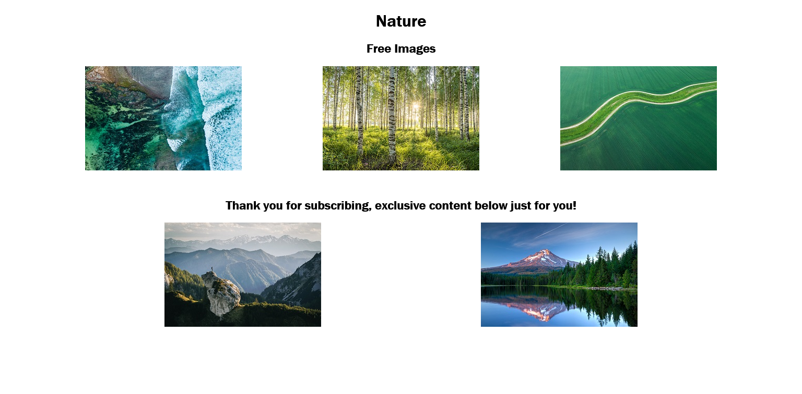

# coil-web-monetization

[#LOCALHACKDAY](https://localhackday.mlh.io/)

I learned about Web Monetization and how to use it in my own website.

The website that I built is very simple and contains five images, three of them are visible to everyone while the remaining two are exclusive.

### Resources
- [Enable Web Monetization on your Website in Minutes](https://stories.mlh.io/enable-web-monetization-on-your-website-in-minutes-27fa8accfcef).

